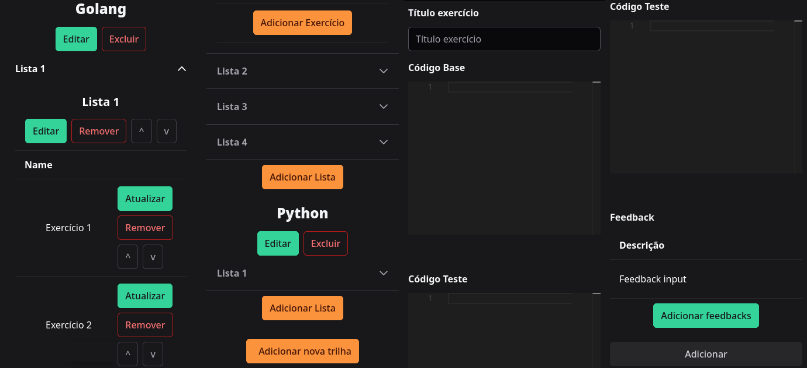
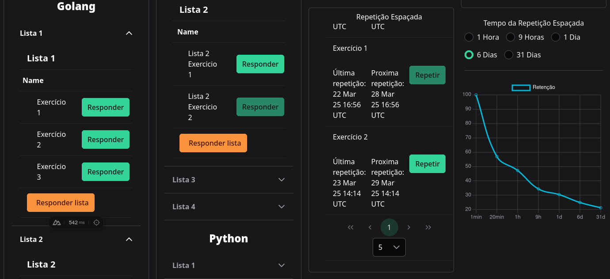
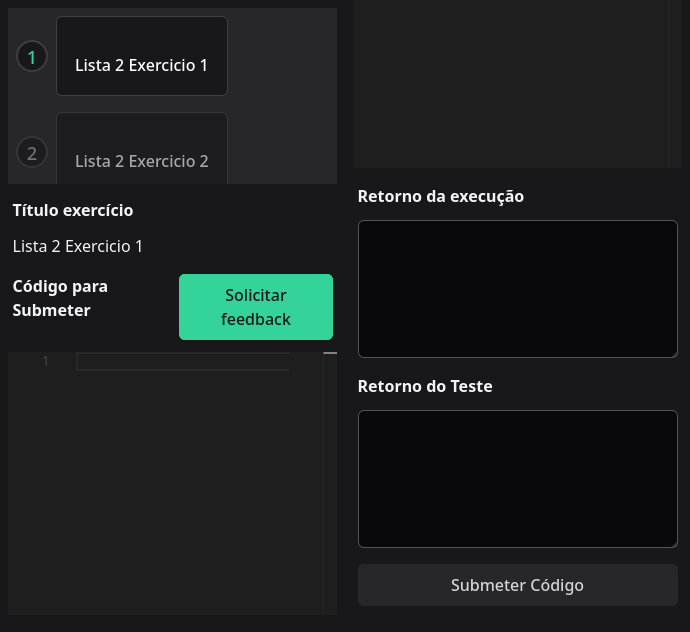
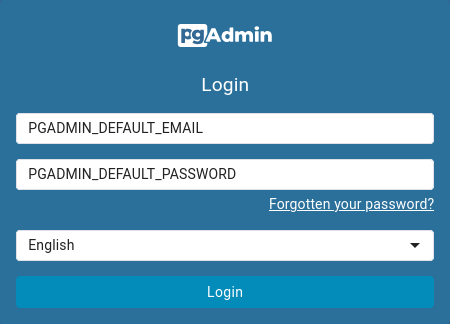
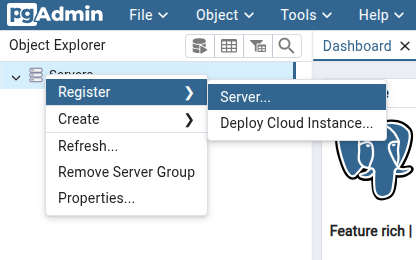
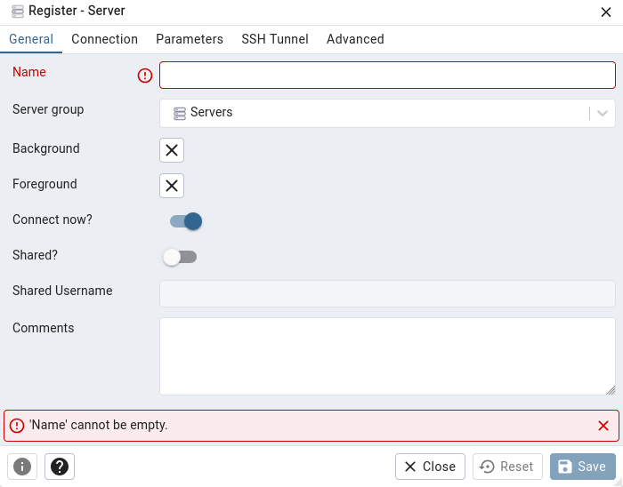
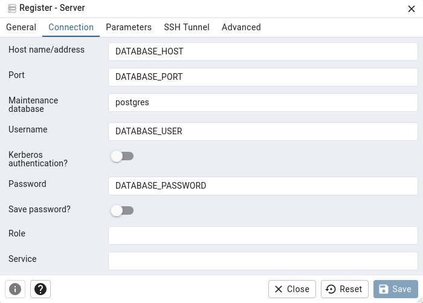
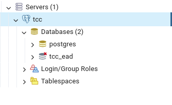

# ADHP: AMBIENTE PARA O DESENVOLVIMENTO DE HABILIDADES EM PROGRAMAÇÃO

Essa ferramenta tem a função de ajudar o instrutor, retirando o trabalho repetitivo de corrigir questões de programação de alunos que estão iniciando na área de programação. Além de ajudar os alunos com a utilização de feedback automatizado para realizar o termino dos exercicios de forma mais eficaz, sendo então explorado o uso da repetição espaçada.

# Rotas
    Docente Rota


--------------------                              --------------------
    Discente Rota


--------------------                              --------------------
    Discente Rota


# Iniciando aplicação
### Exports
Use o arquivo .export.example como base, altere os valores que vem por padrão e use o export em seu terminal preferido, com isso será defino variáveis de ambiente.

### Configurando o nginx
Altere no arquivo ``nginx/nginx.dev.conf`` o endereço IP local **10.0.0.156** para o seu endereço IP local.

### Configurando o frontend
Crie o arquivo **.env** na pasta ``/frontend`` e coloque as configurações abaixo, altere ao seu gosto.

	NUXT_PUBLIC_NUXT_API_URL="http://api.localhost"
	NUXT_PUBLIC_DISCENTE=1
	NUXT_PUBLIC_DOCENTE=2
	NUXT_USE_MONACO_EDITOR=true

### Docker
Para o funcionamento do ambiente faz-se necessário o uso do <a href="https://www.docker.com/">docker</a>

#### Executar o docker
Para build

	docker compose -f compose.dev.yml build

Para execução

	docker compose -f compose.dev.yml up -d

### Acesso ao ambiente
O ambiente deve está acessível no endereço local

	127.0.0.1

### Configuração do banco de dados
Ao executar o ambiente, vai ser exposta algumas portas, sendo elas o localhost:8081 para o pgadmin e o localhost:5432 para o banco de dados.

#### Adicionando um banco de dados ao pgadmin
Para adicionar um novo banco de dados no pgadmin é necessario utilizar os exports definos anteriormente.

	Login



	Clique em Register>Server...



	Escolha um nome para o pgadmin server



	Adicione os dados de conexão do banco de dados, e clique em save




	Lista com o banco de dados



Feito isso o pgadmin está configurado, sendo então possivel fazer as alterações necessários no banco de dados.

#### Criando as tabelas com o Goose
A execução do Goose acontece fora do container, com isso é necessario fazer uma alteração na variável de ambiente DATABASE_HOST 

	export DATABASE_HOST="localhost"

Com as variáveis de ambientes então configuradas usando o export, abra o terminal na pasta backend e execute o comando:

	make db-up

Pronto as tabelas são criadas usando o gerenciador de migração Goose.

#### Alterando o tipo do usuário de discente para docente

É utilizado o **usertype** para definir qual o tipo do usuário, sendo ele discente (1) ou docente (2). Para alterar execute a comando abaixo alterando o email de cadastro e o nivel de acesso com o **usertype**, utilize o terminal configurado com as variáveis de ambiente mencionadas anteriormente.

	PGPASSWORD="$DATABASE_PASSWORD" psql -h "$DATABASE_HOST" -p "$DATABASE_PORT" -U "$DATABASE_USER" -d "$DATABASE_NAME" -c "UPDATE users SET usertype = 2 WHERE email = 'admin@admin.com';"

# Go

module tcc_ead/sum go 1.23.0
```
// go.mod
module tcc_ead/sum

go 1.23.0
```
    Exercício exemplo Golang: 1

```
// sum.go
// this code is running correctly

package main

import "fmt"

func Sum(numOne int, numTwo int) int {
	if numOne == 0 && numTwo == 0 {
		return -1
	}

	if numOne < 0 || numTwo < 0 {
		return 0
	}
	return numOne + numTwo
}

// Você deve fazer uma função que some somente numeros positivos, se por algum motivo o usuario colocar
// 0 + 0, você deve retornar -1
func main() {
    fmt.Println(Sum(0, 0))
}
```

```
// sum_test.go
package main

import "testing"

func TestSumPositiveNumber(t *testing.T) {
	value := Sum(0, 1)

	if value != 1 {
		t.Fatalf("Logic to positive value it's wrong")
	}

	value = Sum(4, 5)

	if value != 9 {
		t.Fatalf("Logic to positive value it's wrong")
	}

	value = Sum(10, 5)

	if value != 15 {
		t.Fatalf("Logic to positive value it's wrong")
	}
}

func TestSumZero(t *testing.T) {
	value := Sum(0, 0)

	if value != -1 {
		t.Fatalf("Check description of exercise: %d", value)
	}
}

func TestSumNegativeNumber(t *testing.T) {
	value := Sum(0, -1)

	if value < 0 {
		t.Fatalf("Logic to negative value it's wrong")
	}

	value = Sum(-1, -1)

	if value < 0 {
		t.Fatalf("Logic to negative value it's wrong")
	}
}
```
--------------------                              --------------------
    Exercício exemplo Golang: 2

```
package main

import "fmt"

func main() {
	a := 5
	b := 5
	c := a + b
	fmt.Println(c)
}
```
```
package main

import (
	"bytes"
	"os"
	"testing"
)

// Função auxiliar para capturar a saída de uma função
func captureOutput(f func()) string {
	// Salva a saída padrão atual
	old := os.Stdout

	// Cria um novo buffer para capturar a saída
	r, w, _ := os.Pipe()
	os.Stdout = w

	// Executa a função
	f()

	// Restaura a saída padrão
	w.Close()
	os.Stdout = old

	// Lê o conteúdo do buffer
	var buf bytes.Buffer
	buf.ReadFrom(r)
	return buf.String()
}

func TestMainOutput(t *testing.T) {
	// Captura a saída da função main
	output := captureOutput(main)

	// Remove a nova linha no final da saída
	output = output[:len(output)-1]

	// Verifica se a saída é "10"
	expected := "10"
	if output != expected {
		t.Errorf("Saída incorreta. Esperado: %s, Obtido: %s", expected, output)
	}
}
```
# Python
    Exercício exemplo Python: 1

```
# sum.py
def sum(num_one, num_two):
    if num_one == 0 and num_two == 0:
        return -1
    
    if num_one < 0 or num_two < 0:
        return 0
    
    return num_one + num_two

# Você deve fazer uma função que some somente numeros positivos, se por algum motivo o usuario colocar
# 0 + 0, você deve retornar -1
def main():
    result = sum(0, 0)
    print(result)  # This will print -1

if __name__ == "__main__":
    main()
```
```
# sum_test.py
import unittest

# The Sum function from the previous example
def sum(num_one, num_two):
    if num_one == 0 and num_two == 0:
        return -1
    
    if num_one < 0 or num_two < 0:
        return 0
    
    return num_one + num_two

# Test cases
class TestSum(unittest.TestCase):
    def test_sum_positive_numbers(self):
        self.assertEqual(sum(0, 1), 1, "Logic for positive values is wrong")
        self.assertEqual(sum(4, 5), 9, "Logic for positive values is wrong")
        self.assertEqual(sum(10, 5), 15, "Logic for positive values is wrong")

    def test_sum_zero(self):
        self.assertEqual(sum(0, 0), -1, "Check description of exercise")

    def test_sum_negative_numbers(self):
        self.assertEqual(sum(0, -1), 0, "Logic for negative values is wrong")
        self.assertEqual(sum(-1, -1), 0, "Logic for negative values is wrong")

# Run the tests
if __name__ == "__main__":
    unittest.main()
```

# Test API Python
curl -X POST -H "Content-Type: application/json" -H "X-Auth-Token: change_to_random_hash" -d '
{
  "source_from_user": "JTIzJTIwc3VtLnB5JTBBZGVmJTIwc3VtKG51bV9vbmUlMkMlMjBudW1fdHdvKSUzQSUwQSUyMCUyMCUyMCUyMGlmJTIwbnVtX29uZSUyMCUzRCUzRCUyMDAlMjBhbmQlMjBudW1fdHdvJTIwJTNEJTNEJTIwMCUzQSUwQSUyMCUyMCUyMCUyMCUyMCUyMCUyMCUyMHJldHVybiUyMC0xJTBBJTIwJTIwJTIwJTIwJTBBJTIwJTIwJTIwJTIwaWYlMjBudW1fb25lJTIwJTNDJTIwMCUyMG9yJTIwbnVtX3R3byUyMCUzQyUyMDAlM0ElMEElMjAlMjAlMjAlMjAlMjAlMjAlMjAlMjByZXR1cm4lMjAwJTBBJTIwJTIwJTIwJTIwJTBBJTIwJTIwJTIwJTIwcmV0dXJuJTIwbnVtX29uZSUyMCUyQiUyMG51bV90d28lMEElMEElMjMlMjBWb2MlQzMlQUElMjBkZXZlJTIwZmF6ZXIlMjB1bWElMjBmdW4lQzMlQTclQzMlQTNvJTIwcXVlJTIwc29tZSUyMHNvbWVudGUlMjBudW1lcm9zJTIwcG9zaXRpdm9zJTJDJTIwc2UlMjBwb3IlMjBhbGd1bSUyMG1vdGl2byUyMG8lMjB1c3VhcmlvJTIwY29sb2NhciUwQSUyMyUyMDAlMjAlMkIlMjAwJTJDJTIwdm9jJUMzJUFBJTIwZGV2ZSUyMHJldG9ybmFyJTIwLTElMEFkZWYlMjBtYWluKCklM0ElMEElMjAlMjAlMjAlMjByZXN1bHQlMjAlM0QlMjBzdW0oMCUyQyUyMDApJTBBJTIwJTIwJTIwJTIwcHJpbnQocmVzdWx0KSUyMCUyMCUyMyUyMFRoaXMlMjB3aWxsJTIwcHJpbnQlMjAtMSUwQSUwQWlmJTIwX19uYW1lX18lMjAlM0QlM0QlMjAlMjJfX21haW5fXyUyMiUzQSUwQSUyMCUyMCUyMCUyMG1haW4oKQ==",
  "source_unit_teste": "JTIzJTIwc3VtX3Rlc3QucHklMEFpbXBvcnQlMjB1bml0dGVzdCUwQSUwQSUyMyUyMFRoZSUyMFN1bSUyMGZ1bmN0aW9uJTIwZnJvbSUyMHRoZSUyMHByZXZpb3VzJTIwZXhhbXBsZSUwQWRlZiUyMHN1bShudW1fb25lJTJDJTIwbnVtX3R3byklM0ElMEElMjAlMjAlMjAlMjBpZiUyMG51bV9vbmUlMjAlM0QlM0QlMjAwJTIwYW5kJTIwbnVtX3R3byUyMCUzRCUzRCUyMDAlM0ElMEElMjAlMjAlMjAlMjAlMjAlMjAlMjAlMjByZXR1cm4lMjAtMSUwQSUyMCUyMCUyMCUyMCUwQSUyMCUyMCUyMCUyMGlmJTIwbnVtX29uZSUyMCUzQyUyMDAlMjBvciUyMG51bV90d28lMjAlM0MlMjAwJTNBJTBBJTIwJTIwJTIwJTIwJTIwJTIwJTIwJTIwcmV0dXJuJTIwMCUwQSUyMCUyMCUyMCUyMCUwQSUyMCUyMCUyMCUyMHJldHVybiUyMG51bV9vbmUlMjAlMkIlMjBudW1fdHdvJTBBJTBBJTIzJTIwVGVzdCUyMGNhc2VzJTBBY2xhc3MlMjBUZXN0U3VtKHVuaXR0ZXN0LlRlc3RDYXNlKSUzQSUwQSUyMCUyMCUyMCUyMGRlZiUyMHRlc3Rfc3VtX3Bvc2l0aXZlX251bWJlcnMoc2VsZiklM0ElMEElMjAlMjAlMjAlMjAlMjAlMjAlMjAlMjBzZWxmLmFzc2VydEVxdWFsKHN1bSgwJTJDJTIwMSklMkMlMjAxJTJDJTIwJTIyTG9naWMlMjBmb3IlMjBwb3NpdGl2ZSUyMHZhbHVlcyUyMGlzJTIwd3JvbmclMjIpJTBBJTIwJTIwJTIwJTIwJTIwJTIwJTIwJTIwc2VsZi5hc3NlcnRFcXVhbChzdW0oNCUyQyUyMDUpJTJDJTIwOSUyQyUyMCUyMkxvZ2ljJTIwZm9yJTIwcG9zaXRpdmUlMjB2YWx1ZXMlMjBpcyUyMHdyb25nJTIyKSUwQSUyMCUyMCUyMCUyMCUyMCUyMCUyMCUyMHNlbGYuYXNzZXJ0RXF1YWwoc3VtKDEwJTJDJTIwNSklMkMlMjAxNSUyQyUyMCUyMkxvZ2ljJTIwZm9yJTIwcG9zaXRpdmUlMjB2YWx1ZXMlMjBpcyUyMHdyb25nJTIyKSUwQSUwQSUyMCUyMCUyMCUyMGRlZiUyMHRlc3Rfc3VtX3plcm8oc2VsZiklM0ElMEElMjAlMjAlMjAlMjAlMjAlMjAlMjAlMjBzZWxmLmFzc2VydEVxdWFsKHN1bSgwJTJDJTIwMCklMkMlMjAtMSUyQyUyMCUyMkNoZWNrJTIwZGVzY3JpcHRpb24lMjBvZiUyMGV4ZXJjaXNlJTIyKSUwQSUwQSUyMCUyMCUyMCUyMGRlZiUyMHRlc3Rfc3VtX25lZ2F0aXZlX251bWJlcnMoc2VsZiklM0ElMEElMjAlMjAlMjAlMjAlMjAlMjAlMjAlMjBzZWxmLmFzc2VydEVxdWFsKHN1bSgwJTJDJTIwLTEpJTJDJTIwMCUyQyUyMCUyMkxvZ2ljJTIwZm9yJTIwbmVnYXRpdmUlMjB2YWx1ZXMlMjBpcyUyMHdyb25nJTIyKSUwQSUyMCUyMCUyMCUyMCUyMCUyMCUyMCUyMHNlbGYuYXNzZXJ0RXF1YWwoc3VtKC0xJTJDJTIwLTEpJTJDJTIwMCUyQyUyMCUyMkxvZ2ljJTIwZm9yJTIwbmVnYXRpdmUlMjB2YWx1ZXMlMjBpcyUyMHdyb25nJTIyKSUwQSUwQSUyMyUyMFJ1biUyMHRoZSUyMHRlc3RzJTBBaWYlMjBfX25hbWVfXyUyMCUzRCUzRCUyMCUyMl9fbWFpbl9fJTIyJTNBJTBBJTIwJTIwJTIwJTIwdW5pdHRlc3QubWFpbigp",
  "lista": "1",
  "exercicio": "1",
  "usuario": "123456789"
}
' localhost:8082/api/v1/run-test-python

# Test API Go
curl -X POST -H "Content-Type: application/json" -H "X-Auth-Token: change_to_random_hash" -d '
{
  "source_from_user": "JTJGJTJGJTIwc3VtLmdvJTBBJTJGJTJGJTIwdGhpcyUyMGNvZGUlMjBpcyUyMHJ1bm5pbmclMjBjb3JyZWN0bHklMEElMEFwYWNrYWdlJTIwbWFpbiUwQSUwQWltcG9ydCUyMCUyMmZtdCUyMiUwQSUwQWZ1bmMlMjBTdW0obnVtT25lJTIwaW50JTJDJTIwbnVtVHdvJTIwaW50KSUyMGludCUyMCU3QiUwQSUwOWlmJTIwbnVtT25lJTIwJTNEJTNEJTIwMCUyMCUyNiUyNiUyMG51bVR3byUyMCUzRCUzRCUyMDAlMjAlN0IlMEElMDklMDlyZXR1cm4lMjAtMSUwQSUwOSU3RCUwQSUwQSUwOWlmJTIwbnVtT25lJTIwJTNDJTIwMCUyMCU3QyU3QyUyMG51bVR3byUyMCUzQyUyMDAlMjAlN0IlMEElMDklMDlyZXR1cm4lMjAwJTBBJTA5JTdEJTBBJTA5cmV0dXJuJTIwbnVtT25lJTIwJTJCJTIwbnVtVHdvJTBBJTdEJTBBJTBBJTJGJTJGJTIwVm9jJUMzJUFBJTIwZGV2ZSUyMGZhemVyJTIwdW1hJTIwZnVuJUMzJUE3JUMzJUEzbyUyMHF1ZSUyMHNvbWUlMjBzb21lbnRlJTIwbnVtZXJvcyUyMHBvc2l0aXZvcyUyQyUyMHNlJTIwcG9yJTIwYWxndW0lMjBtb3Rpdm8lMjBvJTIwdXN1YXJpbyUyMGNvbG9jYXIlMEElMkYlMkYlMjAwJTIwJTJCJTIwMCUyQyUyMHZvYyVDMyVBQSUyMGRldmUlMjByZXRvcm5hciUyMC0xJTBBZnVuYyUyMG1haW4oKSUyMCU3QiUwQSUyMCUyMCUyMCUyMGZtdC5QcmludGxuKFN1bSgwJTJDJTIwMCkpJTBBJTdE",
  "source_unit_teste": "JTJGJTJGJTIwc3VtX3Rlc3QuZ28lMEFwYWNrYWdlJTIwbWFpbiUwQSUwQWltcG9ydCUyMCUyMnRlc3RpbmclMjIlMEElMEFmdW5jJTIwVGVzdFN1bVBvc2l0aXZlTnVtYmVyKHQlMjAqdGVzdGluZy5UKSUyMCU3QiUwQSUwOXZhbHVlJTIwJTNBJTNEJTIwU3VtKDAlMkMlMjAxKSUwQSUwQSUwOWlmJTIwdmFsdWUlMjAhJTNEJTIwMSUyMCU3QiUwQSUwOSUwOXQuRmF0YWxmKCUyMkxvZ2ljJTIwdG8lMjBwb3NpdGl2ZSUyMHZhbHVlJTIwaXQncyUyMHdyb25nJTIyKSUwQSUwOSU3RCUwQSUwQSUwOXZhbHVlJTIwJTNEJTIwU3VtKDQlMkMlMjA1KSUwQSUwQSUwOWlmJTIwdmFsdWUlMjAhJTNEJTIwOSUyMCU3QiUwQSUwOSUwOXQuRmF0YWxmKCUyMkxvZ2ljJTIwdG8lMjBwb3NpdGl2ZSUyMHZhbHVlJTIwaXQncyUyMHdyb25nJTIyKSUwQSUwOSU3RCUwQSUwQSUwOXZhbHVlJTIwJTNEJTIwU3VtKDEwJTJDJTIwNSklMEElMEElMDlpZiUyMHZhbHVlJTIwISUzRCUyMDE1JTIwJTdCJTBBJTA5JTA5dC5GYXRhbGYoJTIyTG9naWMlMjB0byUyMHBvc2l0aXZlJTIwdmFsdWUlMjBpdCdzJTIwd3JvbmclMjIpJTBBJTA5JTdEJTBBJTdEJTBBJTBBZnVuYyUyMFRlc3RTdW1aZXJvKHQlMjAqdGVzdGluZy5UKSUyMCU3QiUwQSUwOXZhbHVlJTIwJTNBJTNEJTIwU3VtKDAlMkMlMjAwKSUwQSUwQSUwOWlmJTIwdmFsdWUlMjAhJTNEJTIwLTElMjAlN0IlMEElMDklMDl0LkZhdGFsZiglMjJDaGVjayUyMGRlc2NyaXB0aW9uJTIwb2YlMjBleGVyY2lzZSUzQSUyMCUyNWQlMjIlMkMlMjB2YWx1ZSklMEElMDklN0QlMEElN0QlMEElMEFmdW5jJTIwVGVzdFN1bU5lZ2F0aXZlTnVtYmVyKHQlMjAqdGVzdGluZy5UKSUyMCU3QiUwQSUwOXZhbHVlJTIwJTNBJTNEJTIwU3VtKDAlMkMlMjAtMSklMEElMEElMDlpZiUyMHZhbHVlJTIwJTNDJTIwMCUyMCU3QiUwQSUwOSUwOXQuRmF0YWxmKCUyMkxvZ2ljJTIwdG8lMjBuZWdhdGl2ZSUyMHZhbHVlJTIwaXQncyUyMHdyb25nJTIyKSUwQSUwOSU3RCUwQSUwQSUwOXZhbHVlJTIwJTNEJTIwU3VtKC0xJTJDJTIwLTEpJTBBJTBBJTA5aWYlMjB2YWx1ZSUyMCUzQyUyMDAlMjAlN0IlMEElMDklMDl0LkZhdGFsZiglMjJMb2dpYyUyMHRvJTIwbmVnYXRpdmUlMjB2YWx1ZSUyMGl0J3MlMjB3cm9uZyUyMiklMEElMDklN0QlMEElN0Q=",
  "lista": "1",
  "exercicio": "1",
  "usuario": "123456789"
}
' localhost:8082/api/v1/run-test-golang
